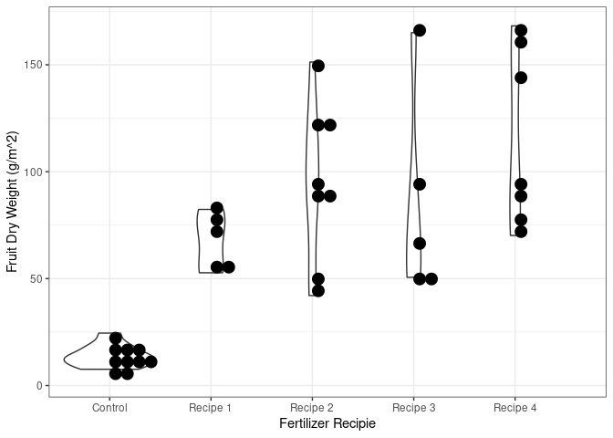
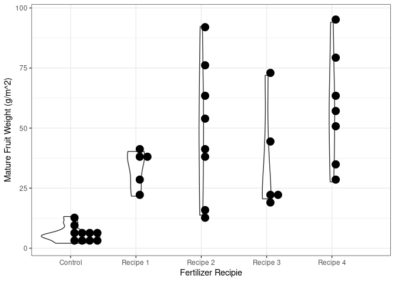
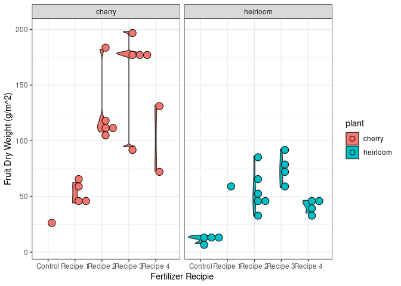

## Overview

Simplified version of a tomato growth and yield model for Tomato Trials
<link to come>.

## References

-   [Jones, J. W., Dayan, E., Allen, L. H., Van Keulen, H., & Challa, H.
    (1991). A dynamic tomato growth and yield model (TOMGRO).
    Transactions of the ASAE, 34(2),
    663-0672.](https://www.researchgate.net/profile/Leon-Allen-3/publication/40142875_A_dynamic_tomato_growth_and_yield_model_TOMGRO/links/58911ee9a6fdcc1b41453859/A-dynamic-tomato-growth-and-yield-model-TOMGRO.pdf)
-   [Jones, J. W., Kenig, A., & Vallejos, C. E. (1999). Reduced
    state–variable tomato growth model. Transactions of the ASAE, 42(1),
    255-265.](https://www.researchgate.net/profile/James-Jones-30/publication/274529819_Reduced_state-variable_tomato_growth_model/links/5f3ed116a6fdcccc43db9fb2/Reduced-state-variable-tomato-growth-model.pdf)
-   [GitHub ’@gyosit\` gist of TOMGRO model in
    python](https://gist.github.com/gyosit/abeab4e595d7ddcd65b55c1270d240c8)

## Description

The file `tomgro.r` contains the required functions to simulate tomato
yield based on daily average temperatures (∘C),
photosynthetic photon flux density, PPFD (light intensity),

## Tomato Trials examples

    source("tomgro.r")
    ## plant_type and percent_manure are user input 7x7 arrays
    ## where the path indecies (5, 1), (5, 2), (5, 3), (4, 5), (4, 6), (4, 7)
    ## are ignored (maybe set to "path" or NA if numeric)
    ## NOTE
    ## if only a single type of plant is used then there are only 30 seedlings
    ## and the function will pick up on this by IDing NA percent_manure values in the array
    ## example
    plant_type <- matrix(sample(c("cherry", "heirloom"), replace = TRUE, size = 49), nrow = 7)
    percent_manure <- matrix(sample(c(0, 10, 30, 50, 80), replace = TRUE, size = 49), nrow = 7)
    ## path index
    idx <- cbind(c(5, 5, 5, 4, 4, 4,1:7), c(1:3, 5:7, rep(4,7)))
    plant_type[idx] <-  "path"
    plant_type

    ##      [,1]       [,2]       [,3]       [,4]   [,5]       [,6]       [,7]      
    ## [1,] "cherry"   "cherry"   "cherry"   "path" "cherry"   "heirloom" "heirloom"
    ## [2,] "cherry"   "cherry"   "cherry"   "path" "heirloom" "cherry"   "cherry"  
    ## [3,] "heirloom" "heirloom" "heirloom" "path" "heirloom" "heirloom" "heirloom"
    ## [4,] "cherry"   "heirloom" "cherry"   "path" "path"     "path"     "path"    
    ## [5,] "path"     "path"     "path"     "path" "heirloom" "cherry"   "cherry"  
    ## [6,] "cherry"   "heirloom" "heirloom" "path" "cherry"   "cherry"   "cherry"  
    ## [7,] "cherry"   "cherry"   "cherry"   "path" "cherry"   "heirloom" "heirloom"

    percent_manure[idx] <- NA
    percent_manure

    ##      [,1] [,2] [,3] [,4] [,5] [,6] [,7]
    ## [1,]   80   80   30   NA   30   30   10
    ## [2,]   30    0   10   NA   30   80    0
    ## [3,]    0   50   10   NA    0   80   30
    ## [4,]   10   50   30   NA   NA   NA   NA
    ## [5,]   NA   NA   NA   NA   50   10   80
    ## [6,]   50   30   30   NA   50   80    0
    ## [7,]    0   80    0   NA    0    0    0

### Simulation

    ## map recipe names to % values
    recipes <- c("Control" = 0, "Recipe 1" = 10, "Recipe 2" = 30, "Recipe 3" = 50, "Recipe 4" = 80)
    results <- tomgro(plant_type = plant_type, percent_manure = percent_manure, recipes = recipes, prob_die = c(0.1, 0.5))
    results

    ##    row col    plant   recipe percent_manure survived total_plant_weight
    ## 1    1   1   cherry Recipe 4             80      yes           996.7536
    ## 2    2   1   cherry Recipe 2             30      yes          1014.3090
    ## 3    3   1 heirloom  Control              0      yes           445.6660
    ## 4    4   1   cherry Recipe 1             10      yes           977.0782
    ## 6    6   1   cherry Recipe 3             50      yes           963.8403
    ## 7    7   1   cherry  Control              0      yes           535.7445
    ## 8    1   2   cherry Recipe 4             80      yes          1038.9848
    ## 9    2   2   cherry  Control              0      yes           561.2293
    ## 10   3   2 heirloom Recipe 3             50      yes           957.4402
    ## 11   4   2 heirloom Recipe 3             50      yes           949.6302
    ## 13   6   2 heirloom Recipe 2             30      yes           901.3782
    ## 14   7   2   cherry Recipe 4             80      yes           971.3710
    ## 15   1   3   cherry Recipe 2             30      yes          1104.5500
    ## 16   2   3   cherry Recipe 1             10      yes          1049.6304
    ## 17   3   3 heirloom Recipe 1             10      yes           978.7397
    ## 18   4   3   cherry Recipe 2             30      yes          1092.7910
    ## 20   6   3 heirloom Recipe 2             30      yes           905.0123
    ## 21   7   3   cherry  Control              0      yes           600.7992
    ## 29   1   5   cherry Recipe 2             30      yes          1191.7500
    ## 30   2   5 heirloom Recipe 2             30       no                 NA
    ## 31   3   5 heirloom  Control              0      yes           569.7472
    ## 33   5   5 heirloom Recipe 3             50      yes           994.7734
    ## 34   6   5   cherry Recipe 3             50      yes          1096.7607
    ## 35   7   5   cherry  Control              0      yes           660.6432
    ## 36   1   6 heirloom Recipe 2             30      yes          1097.3839
    ## 37   2   6   cherry Recipe 4             80      yes          1189.2651
    ## 38   3   6 heirloom Recipe 4             80      yes          1046.0196
    ## 40   5   6   cherry Recipe 1             10      yes          1023.7587
    ## 41   6   6   cherry Recipe 4             80      yes          1076.2098
    ## 42   7   6 heirloom  Control              0      yes           529.8547
    ## 43   1   7 heirloom Recipe 1             10      yes          1079.1318
    ## 44   2   7   cherry  Control              0      yes           719.5201
    ## 45   3   7 heirloom Recipe 2             30      yes          1097.8289
    ## 47   5   7   cherry Recipe 4             80      yes          1125.1346
    ## 48   6   7   cherry  Control              0      yes           715.1987
    ## 49   7   7 heirloom  Control              0      yes           543.9440
    ##    fruit_dry_weight mature_fruit_weight
    ## 1         79.045082           49.711400
    ## 2         89.367525           53.098677
    ## 3         10.456143            4.197115
    ## 4         53.889387           27.088376
    ## 6         92.608446           44.018924
    ## 7         11.430484            4.659323
    ## 8         91.839767           57.972845
    ## 9         19.311902           10.516398
    ## 10        50.613811           21.404805
    ## 11        50.957142           20.547479
    ## 13        42.078082           13.784180
    ## 14        86.514559           34.990993
    ## 15       119.125577           77.325256
    ## 16        69.734121           40.296137
    ## 17        52.725950           21.659619
    ## 18       121.351689           63.214863
    ## 20        50.420209           14.822233
    ## 21        12.619294            4.961214
    ## 29       151.274408           92.271091
    ## 30               NA                  NA
    ## 31        13.773766            5.761197
    ## 33        67.534920           23.309286
    ## 34       165.015490           71.945374
    ## 35        14.546234            5.632877
    ## 36        89.512007           41.765137
    ## 37       160.643761           94.063460
    ## 38        70.169685           27.623570
    ## 40        82.355694           38.475165
    ## 41       145.585522           62.725547
    ## 42         7.609507            2.048767
    ## 43        79.145560           37.608596
    ## 44        24.529268           13.192180
    ## 45        96.497141           39.235187
    ## 47       168.178009           78.505019
    ## 48        17.468254            7.559356
    ## 49         8.100286            2.217403

### The ‘TRUE’ effect of manure

    ## Loading required package: ggplot2

## Further examples & student plotting code

### Just 30 Cherry seedlings

    ## Just 30 Cherry tomato seedlings
    ## setting up data
    plant_type <- matrix(rep("cherry", 49), nrow = 7) 
    percent_manure <- matrix(sample(c(0, 10, 30, 50, 80), replace = TRUE, size = 49), nrow = 7)
    ## path index
    idx <- cbind(c(5, 5, 5, 4, 4, 4,1:7), c(1:3, 5:7, rep(4,7)))
    ## six missing planters
    idx_empty <- cbind(c(1:3, 5:7), c(1:3, rep(7, 3)))
    plant_type[idx] <-  "path"
    plant_type[idx_empty] <-  "empty"
    percent_manure[rbind(idx, idx_empty)] <- NA
    recipes <- c("Control" = 0, "Recipe 1" = 10, "Recipe 2" = 30, "Recipe 3" = 50, "Recipe 4" = 80)
    results <- tomgro(plant_type = plant_type, percent_manure = percent_manure, recipes = recipes, prob_die = c(0.1, 0.5))
    results
    library(ggplot2)
    ## one tomato type
    ggplot(data = results, aes(x = recipe, y = fruit_dry_weight)) +
      geom_violin() + geom_dotplot(binaxis = "y", method = "histodot") +
      theme_bw() + xlab("Fertilizer Recipie") + ylab("Fruit Dry Weight (g/m^2)")
    ggplot(data = results, aes(x = recipe, y = mature_fruit_weight)) +
      geom_violin() + geom_dotplot(binaxis = "y", method = "histodot") +
      theme_bw() + xlab("Fertilizer Recipie") + ylab("Mature Fruit Weight (g/m^2)")

### Just 30 Heirloom seedings

    ## Just 30 Cherry tomato seedlings
    ## setting up data
    plant_type <- matrix(rep("heirloom", 49), nrow = 7) 
    percent_manure <- matrix(sample(c(0, 10, 30, 60, 80), replace = TRUE, size = 49), nrow = 7)
    ## path index
    idx <- cbind(c(5, 5, 5, 4, 4, 4,1:7), c(1:3, 5:7, rep(4,7)))
    ## six missing planters
    idx_empty <- cbind(c(1:3, 5:7), c(1:3, rep(7, 3)))
    plant_type[idx] <-  "path"
    plant_type[idx_empty] <-  "empty"
    percent_manure[rbind(idx, idx_empty)] <- NA
    recipes <- c("Control" = 0, "Recipe 1" = 10, "Recipe 2" = 30, "Recipe 3" = 60, "Recipe 4" = 80)
    results <- tomgro(plant_type = plant_type, percent_manure = percent_manure, recipes = recipes, prob_die = c(0.1, 0.5))

    ## plotting code for students
    library(ggplot2)
    ## one tomato type
    ggplot(data = results, aes(x = recipe, y = fruit_dry_weight)) +
      geom_violin() + geom_dotplot(binaxis = "y", method = "histodot") +
      theme_bw() + xlab("Fertilizer Recipie") + ylab("Fruit Dry Weight (g/m^2)")

    ## Warning: Removed 1 row containing non-finite outside the scale range
    ## (`stat_ydensity()`).

    ## Bin width defaults to 1/30 of the range of the data. Pick better value with
    ## `binwidth`.

    ## Warning: Removed 1 row containing missing values or values outside the scale range
    ## (`stat_bindot()`).

    ggplot(data = results, aes(x = recipe, y = mature_fruit_weight)) +
      geom_violin() + geom_dotplot(binaxis = "y", method = "histodot") +
      theme_bw() + xlab("Fertilizer Recipie") + ylab("Mature Fruit Weight (g/m^2)")

    ## Warning: Removed 1 row containing non-finite outside the scale range
    ## (`stat_ydensity()`).

    ## Bin width defaults to 1/30 of the range of the data. Pick better value with
    ## `binwidth`.

    ## Warning: Removed 1 row containing missing values or values outside the scale range
    ## (`stat_bindot()`).

### Heirloom & Cherry seedings

    plant_type <- matrix(sample(c("cherry", "heirloom"), replace = TRUE, size = 49), nrow = 7)
    percent_manure <- matrix(sample(c(0, 10, 40, 60, 90), replace = TRUE, size = 49), nrow = 7)
    ## path index
    idx <- cbind(c(5, 5, 5, 4, 4, 4,1:7), c(1:3, 5:7, rep(4,7)))
    plant_type[idx] <-  "path"
    percent_manure[idx] <- NA
    recipes <- c("Control" = 0, "Recipe 1" = 10, "Recipe 2" = 40, "Recipe 3" = 60, "Recipe 4" = 90)
    results <- tomgro(plant_type = plant_type, percent_manure = percent_manure, recipes = recipes, prob_die = c(0.1, 0.5))

    ## plotting code for students
    library(ggplot2)
    ggplot(data = results, aes(x = recipe, y = fruit_dry_weight, fill = plant)) +
      geom_violin() + geom_dotplot(binaxis = "y", method = "histodot") +
      theme_bw() + xlab("Fertilizer Recipie") + ylab("Fruit Dry Weight (g/m^2)") +
      facet_wrap(~plant)

