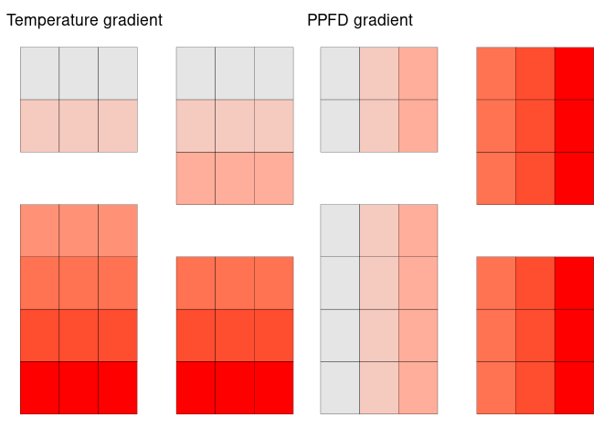

## Overview

Simplified version of a tomato growth and yield model for Tomato Trials
<link to come>.

## References

-   [Jones, J. W., Dayan, E., Allen, L. H., Van Keulen, H., & Challa, H.
    (1991). A dynamic tomato growth and yield model (TOMGRO).
    Transactions of the ASAE, 34(2),
    663-0672.](https://www.researchgate.net/profile/Leon-Allen-3/publication/40142875_A_dynamic_tomato_growth_and_yield_model_TOMGRO/links/58911ee9a6fdcc1b41453859/A-dynamic-tomato-growth-and-yield-model-TOMGRO.pdf)
-   [Jones, J. W., Kenig, A., & Vallejos, C. E. (1999). Reduced
    state–variable tomato growth model. Transactions of the ASAE, 42(1),
    255-265.](https://www.researchgate.net/profile/James-Jones-30/publication/274529819_Reduced_state-variable_tomato_growth_model/links/5f3ed116a6fdcccc43db9fb2/Reduced-state-variable-tomato-growth-model.pdf)
-   [GitHub ’@gyosit\` gist of TOMGRO model in
    python](https://gist.github.com/gyosit/abeab4e595d7ddcd65b55c1270d240c8)

## Description

The file `tomgro.r` contains the required equations to simulate tomato
yield based on daily average temperatures (∘C) and
photosynthetic photon flux density, PPFD (light intensity).

## Tomato Trials example

    source("tomgro.r")
    ## set up environmental data
    require(lubridate)

    ## Loading required package: lubridate

    ## 
    ## Attaching package: 'lubridate'

    ## The following objects are masked from 'package:base':
    ## 
    ##     date, intersect, setdiff, union

    dates <- seq(lubridate::ymd_h("2024-01-01-00"), lubridate::ymd_h("2024-06-30-23"), by = "days")
    ## from left to right PPFD gets stronger
    PPFD_gradient <- matrix(rep(seq(140, 200, length.out = 7), each = 7), nrow = 7)
    ## from top to bottom temp gets cooler
    temp_gradient <- matrix(rep(seq(28, 21, length.out = 7), each = 7), nrow = 7, byrow = TRUE)
    ## path index
    idx <- cbind(c(5, 5, 5, 4, 4, 4,1:7), c(1:3, 5:7, rep(4,7)))
    temp_gradient[idx] <- PPFD_gradient[idx] <-  NA

### Baseline Greenhouse environmenlat variables

### Simulating data based on environmental data alone

Note plant and fertilizer choices TODO (just involves changing
coefficients of growth equations)

    ## output matricies
    outputW <- outputWf <- outputWm <- matrix(NA, nrow = 7, ncol = 7)
    for(i in 1:7){ ## rows
        for(j in 1:7){ ## cols
            if(!is.na(temp_gradient[i, j]) & !is.na(PPFD_gradient[i, j])){
                temp <- rnorm(length(dates), temp_gradient[i, j], 1) +
                    (cos(lubridate::day(dates))/(length(lubridate::day(dates))/5))
                ppfd <- rnorm(length(dates), PPFD_gradient[i, j], 20)
                gr <- grow(T = temp, PPFD = ppfd)
                outputW[i, j] <- gr[1]
                outputWf[i, j] <- gr[2]
                outputWm[i, j] <- gr[3]
            }
        }
    }
    ## Structure 
    output <- data.frame(row = rep(1:7, times = 7),
                         col = rep(1:7, each = 7),
                         total_plant_weight = c(outputW),
                         fruit_dry_weight = c(outputWf),
                         mature_fruit_weight = c(outputWm))
    output <- subset(output, !is.na(output$total_plant_weight))
    ## structure of data to download
    head(output)

    ##   row col total_plant_weight fruit_dry_weight mature_fruit_weight
    ## 1   1   1           709.1281         36.28879            29.44600
    ## 2   2   1           716.5291         34.49983            27.72386
    ## 3   3   1           728.4007         31.42083            24.86855
    ## 4   4   1           769.2192         29.88152            22.74574
    ## 6   6   1           838.5590         26.38313            18.59797
    ## 7   7   1           828.4996         23.05504            15.53268

#### Illustration of output

## Example student plotting code

    library(ggplot2)
    ## one tomato type
    ggplot(data = data, aes(x = treatment, y = fruit_dry_weight)) +
      geom_violin() + geom_dotplot(binaxis = "y", method = "histodot") +
      theme_bw() + xlab("Fertilizer Recipie") + ylab("Fruit Dry Weight (g/m^2)")
    ## two tomato types
    ggplot(data = data, aes(x = treatment, y = fruit_dry_weight)) +
      geom_violin() + geom_dotplot(binaxis = "y", method = "histodot") +
      theme_bw() + xlab("Fertilizer Recipie") + ylab("Fruit Dry Weight (g/m^2)") +
      facet_wrap(~species)
