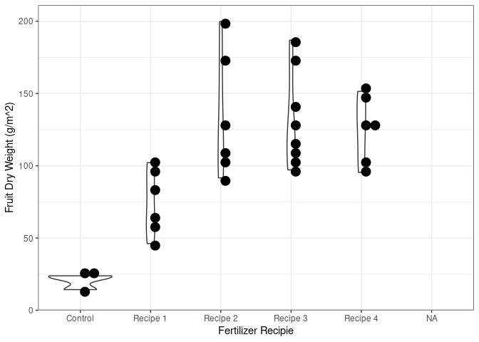
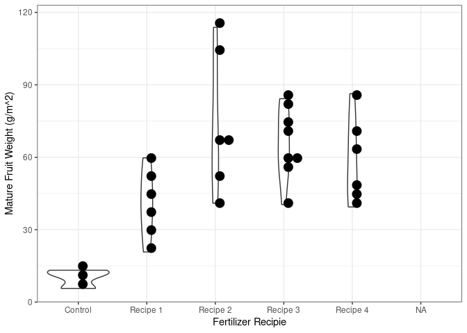
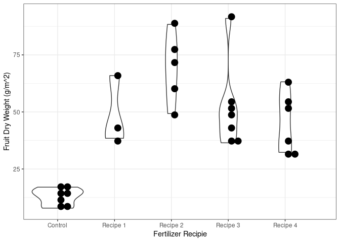
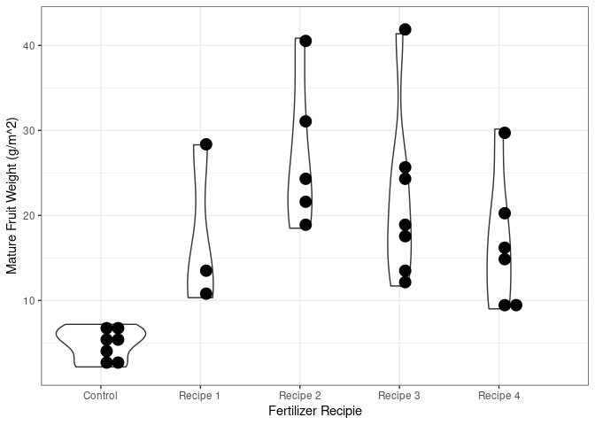
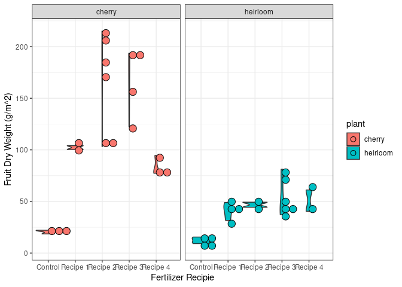

## Overview

Simplified version of a tomato growth and yield model for Tomato Trials
<link to come>.

## References

-   [Jones, J. W., Dayan, E., Allen, L. H., Van Keulen, H., & Challa, H.
    (1991). A dynamic tomato growth and yield model (TOMGRO).
    Transactions of the ASAE, 34(2),
    663-0672.](https://www.researchgate.net/profile/Leon-Allen-3/publication/40142875_A_dynamic_tomato_growth_and_yield_model_TOMGRO/links/58911ee9a6fdcc1b41453859/A-dynamic-tomato-growth-and-yield-model-TOMGRO.pdf)
-   [Jones, J. W., Kenig, A., & Vallejos, C. E. (1999). Reduced
    state–variable tomato growth model. Transactions of the ASAE, 42(1),
    255-265.](https://www.researchgate.net/profile/James-Jones-30/publication/274529819_Reduced_state-variable_tomato_growth_model/links/5f3ed116a6fdcccc43db9fb2/Reduced-state-variable-tomato-growth-model.pdf)
-   [GitHub ’@gyosit\` gist of TOMGRO model in
    python](https://gist.github.com/gyosit/abeab4e595d7ddcd65b55c1270d240c8)

## Description

The file `tomgro.r` contains the required functions to simulate tomato
yield based on daily average temperatures (∘C),
photosynthetic photon flux density, PPFD (light intensity),

## Tomato Trials examples

    source("tomgro.r")
    ## plant_type and percent_manure are user input 7x7 arrays
    ## where the path indecies (5, 1), (5, 2), (5, 3), (4, 5), (4, 6), (4, 7)
    ## are ignored (maybe set to "path" or NA if numeric)
    ## NOTE
    ## if only a single type of plant is used then there are only 30 seedlings
    ## and the function will pick up on this by IDing NA percent_manure values in the array
    ## example
    plant_type <- matrix(sample(c("cherry", "heirloom"), replace = TRUE, size = 49), nrow = 7)
    percent_manure <- matrix(sample(c(0, 10, 30, 50, 80), replace = TRUE, size = 49), nrow = 7)
    ## path index
    idx <- cbind(c(5, 5, 5, 4, 4, 4,1:7), c(1:3, 5:7, rep(4,7)))
    plant_type[idx] <-  "path"
    plant_type

    ##      [,1]       [,2]       [,3]       [,4]   [,5]       [,6]       [,7]      
    ## [1,] "heirloom" "cherry"   "cherry"   "path" "cherry"   "heirloom" "cherry"  
    ## [2,] "heirloom" "heirloom" "cherry"   "path" "heirloom" "cherry"   "heirloom"
    ## [3,] "heirloom" "cherry"   "cherry"   "path" "heirloom" "heirloom" "heirloom"
    ## [4,] "cherry"   "heirloom" "cherry"   "path" "path"     "path"     "path"    
    ## [5,] "path"     "path"     "path"     "path" "heirloom" "heirloom" "cherry"  
    ## [6,] "cherry"   "cherry"   "heirloom" "path" "cherry"   "heirloom" "heirloom"
    ## [7,] "cherry"   "heirloom" "cherry"   "path" "cherry"   "heirloom" "heirloom"

    percent_manure[idx] <- NA
    percent_manure

    ##      [,1] [,2] [,3] [,4] [,5] [,6] [,7]
    ## [1,]   30   10   10   NA   30   80   10
    ## [2,]   10   80   10   NA    0   80   30
    ## [3,]   50   10    0   NA   10   80   30
    ## [4,]   10   50   30   NA   NA   NA   NA
    ## [5,]   NA   NA   NA   NA   30   10   10
    ## [6,]   80   30   10   NA   80   30   80
    ## [7,]   80   30    0   NA   10   50   30

### Simulation

    ## map recipe names to % values
    recipes <- c("Control" = 0, "Recipe 1" = 10, "Recipe 2" = 30, "Recipe 3" = 50, "Recipe 4" = 80)
    results <- tomgro(plant_type = plant_type, percent_manure = percent_manure, recipes = recipes, prob_die = c(0.1, 0.5))
    results

    ##    row col    plant   recipe percent_manure survived total_plant_weight
    ## 1    1   1 heirloom Recipe 2             30      yes           849.1212
    ## 2    2   1 heirloom Recipe 1             10      yes           845.4350
    ## 3    3   1 heirloom Recipe 3             50      yes           894.2007
    ## 4    4   1   cherry Recipe 1             10      yes           968.7056
    ## 6    6   1   cherry Recipe 4             80      yes          1001.6359
    ## 7    7   1   cherry Recipe 4             80      yes           931.8668
    ## 8    1   2   cherry Recipe 1             10      yes           973.0764
    ## 9    2   2 heirloom Recipe 4             80      yes           912.0706
    ## 10   3   2   cherry Recipe 1             10       no                 NA
    ## 11   4   2 heirloom Recipe 3             50      yes           957.3382
    ## 13   6   2   cherry Recipe 2             30      yes          1022.5205
    ## 14   7   2 heirloom Recipe 2             30      yes           860.1848
    ## 15   1   3   cherry Recipe 1             10      yes           993.0728
    ## 16   2   3   cherry Recipe 1             10      yes          1039.7724
    ## 17   3   3   cherry  Control              0      yes           598.7451
    ## 18   4   3   cherry Recipe 2             30      yes          1076.5858
    ## 20   6   3 heirloom Recipe 1             10      yes           910.6792
    ## 21   7   3   cherry  Control              0      yes           593.2357
    ## 29   1   5   cherry Recipe 2             30      yes          1190.9471
    ## 30   2   5 heirloom  Control              0      yes           576.5829
    ## 31   3   5 heirloom Recipe 1             10      yes          1015.2409
    ## 33   5   5 heirloom Recipe 2             30      yes           993.1862
    ## 34   6   5   cherry Recipe 4             80      yes          1059.3804
    ## 35   7   5   cherry Recipe 1             10      yes           941.9839
    ## 36   1   6 heirloom Recipe 4             80      yes          1079.0536
    ## 37   2   6   cherry Recipe 4             80      yes          1192.7299
    ## 38   3   6 heirloom Recipe 4             80      yes          1047.0076
    ## 40   5   6 heirloom Recipe 1             10      yes           978.1433
    ## 41   6   6 heirloom Recipe 2             30       no                 NA
    ## 42   7   6 heirloom Recipe 3             50      yes           934.3269
    ## 43   1   7   cherry Recipe 1             10      yes          1096.1904
    ## 44   2   7 heirloom Recipe 2             30      yes          1120.6759
    ## 45   3   7 heirloom Recipe 2             30      yes          1094.9508
    ## 47   5   7   cherry Recipe 1             10      yes          1039.1453
    ## 48   6   7 heirloom Recipe 4             80      yes           963.5239
    ## 49   7   7 heirloom Recipe 2             30      yes           948.7971
    ##    fruit_dry_weight mature_fruit_weight
    ## 1          46.19069           23.159258
    ## 2          33.04024           16.816265
    ## 3          44.33791           19.933408
    ## 4          50.36874           26.428716
    ## 6          79.90003           35.894522
    ## 7          75.59620           30.993705
    ## 8          55.96686           33.855208
    ## 9          45.31739           21.315009
    ## 10               NA                  NA
    ## 11         46.22767           17.888410
    ## 13        101.73324           46.475272
    ## 14         37.44542            9.819733
    ## 15         63.02665           39.762609
    ## 16         66.11574           38.580667
    ## 17         19.17483            9.834894
    ## 18        117.39701           59.131289
    ## 20         42.91232           13.101518
    ## 21         12.48866            4.929454
    ## 29        150.31819           90.087236
    ## 30         15.13464            6.442484
    ## 31         61.29451           25.466821
    ## 33         65.05005           23.130959
    ## 34        133.33237           57.051296
    ## 35         70.65914           28.358498
    ## 36         67.34472           32.235230
    ## 37        161.45473           90.569600
    ## 38         69.45904           27.040687
    ## 40         60.15297           20.646578
    ## 41               NA                  NA
    ## 42         58.76525           15.575122
    ## 43        102.46430           60.934165
    ## 44         96.14450           42.824104
    ## 45         93.72086           38.064710
    ## 47         94.41022           45.102237
    ## 48         64.00961           18.862558
    ## 49         64.99651           18.389947

### The ‘TRUE’ effect of manure

## Further examples & student plotting code

### Just 30 Cherry seedlings

    ## Just 30 Cherry tomato seedlings
    ## setting up data
    plant_type <- matrix(rep("cherry", 49), nrow = 7) 
    percent_manure <- matrix(sample(c(0, 10, 30, 50, 80), replace = TRUE, size = 49), nrow = 7)
    ## path index
    idx <- cbind(c(5, 5, 5, 4, 4, 4,1:7), c(1:3, 5:7, rep(4,7)))
    ## six missing planters
    idx_empty <- cbind(c(1:3, 5:7), c(1:3, rep(7, 3)))
    plant_type[idx] <-  "path"
    plant_type[idx_empty] <-  "empty"
    percent_manure[rbind(idx, idx_empty)] <- NA
    recipes <- c("Control" = 0, "Recipe 1" = 10, "Recipe 2" = 30, "Recipe 3" = 50, "Recipe 4" = 80)
    results <- tomgro(plant_type = plant_type, percent_manure = percent_manure, recipes = recipes, prob_die = c(0.1, 0.5))

    ##plotting code for students
    library(ggplot2)
    ggplot(data = results, aes(x = recipe, y = fruit_dry_weight)) +
      geom_violin() + geom_dotplot(binaxis = "y", method = "histodot") +
      theme_bw() + xlab("Fertilizer Recipie") + ylab("Fruit Dry Weight (g/m^2)")

    ggplot(data = results, aes(x = recipe, y = mature_fruit_weight)) +
      geom_violin() + geom_dotplot(binaxis = "y", method = "histodot") +
      theme_bw() + xlab("Fertilizer Recipie") + ylab("Mature Fruit Weight (g/m^2)")

### Just 30 Heirloom seedings

    ## Just 30 Cherry tomato seedlings
    ## setting up data
    plant_type <- matrix(rep("heirloom", 49), nrow = 7) 
    percent_manure <- matrix(sample(c(0, 10, 30, 60, 80), replace = TRUE, size = 49), nrow = 7)
    ## path index
    idx <- cbind(c(5, 5, 5, 4, 4, 4,1:7), c(1:3, 5:7, rep(4,7)))
    ## six missing planters
    idx_empty <- cbind(c(1:3, 5:7), c(1:3, rep(7, 3)))
    plant_type[idx] <-  "path"
    plant_type[idx_empty] <-  "empty"
    percent_manure[rbind(idx, idx_empty)] <- NA
    recipes <- c("Control" = 0, "Recipe 1" = 10, "Recipe 2" = 30, "Recipe 3" = 60, "Recipe 4" = 80)
    results <- tomgro(plant_type = plant_type, percent_manure = percent_manure, recipes = recipes, prob_die = c(0.1, 0.5))

    ## plotting code for students
    library(ggplot2)
    ## one tomato type
    ggplot(data = results, aes(x = recipe, y = fruit_dry_weight)) +
      geom_violin() + geom_dotplot(binaxis = "y", method = "histodot") +
      theme_bw() + xlab("Fertilizer Recipie") + ylab("Fruit Dry Weight (g/m^2)")

    ggplot(data = results, aes(x = recipe, y = mature_fruit_weight)) +
      geom_violin() + geom_dotplot(binaxis = "y", method = "histodot") +
      theme_bw() + xlab("Fertilizer Recipie") + ylab("Mature Fruit Weight (g/m^2)")

### Heirloom & Cherry seedings

    plant_type <- matrix(sample(c("cherry", "heirloom"), replace = TRUE, size = 49), nrow = 7)
    percent_manure <- matrix(sample(c(0, 10, 40, 60, 90), replace = TRUE, size = 49), nrow = 7)
    ## path index
    idx <- cbind(c(5, 5, 5, 4, 4, 4,1:7), c(1:3, 5:7, rep(4,7)))
    plant_type[idx] <-  "path"
    percent_manure[idx] <- NA
    recipes <- c("Control" = 0, "Recipe 1" = 10, "Recipe 2" = 40, "Recipe 3" = 60, "Recipe 4" = 90)
    results <- tomgro(plant_type = plant_type, percent_manure = percent_manure, recipes = recipes, prob_die = c(0.1, 0.5))

    ## plotting code for students
    library(ggplot2)
    ggplot(data = results, aes(x = recipe, y = fruit_dry_weight, fill = plant)) +
      geom_violin() + geom_dotplot(binaxis = "y", method = "histodot") +
      theme_bw() + xlab("Fertilizer Recipie") + ylab("Fruit Dry Weight (g/m^2)") +
      facet_wrap(~plant)

