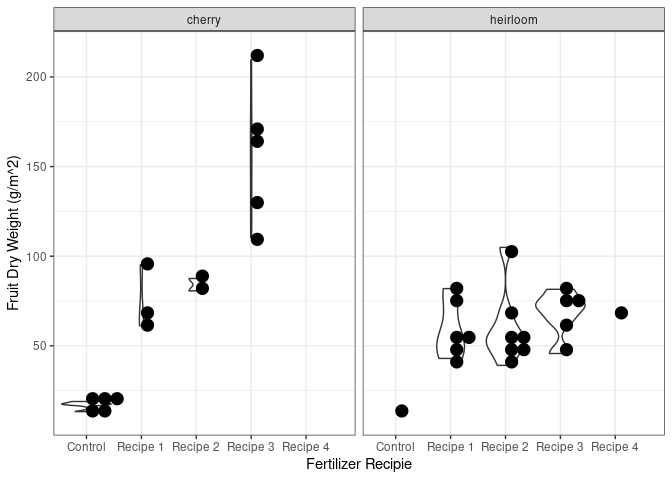

## Overview

Simplified version of a tomato growth and yield model for Tomato Trials
<link to come>.

## References

-   [Jones, J. W., Dayan, E., Allen, L. H., Van Keulen, H., & Challa, H.
    (1991). A dynamic tomato growth and yield model (TOMGRO).
    Transactions of the ASAE, 34(2),
    663-0672.](https://www.researchgate.net/profile/Leon-Allen-3/publication/40142875_A_dynamic_tomato_growth_and_yield_model_TOMGRO/links/58911ee9a6fdcc1b41453859/A-dynamic-tomato-growth-and-yield-model-TOMGRO.pdf)
-   [Jones, J. W., Kenig, A., & Vallejos, C. E. (1999). Reduced
    state–variable tomato growth model. Transactions of the ASAE, 42(1),
    255-265.](https://www.researchgate.net/profile/James-Jones-30/publication/274529819_Reduced_state-variable_tomato_growth_model/links/5f3ed116a6fdcccc43db9fb2/Reduced-state-variable-tomato-growth-model.pdf)
-   [GitHub ’@gyosit\` gist of TOMGRO model in
    python](https://gist.github.com/gyosit/abeab4e595d7ddcd65b55c1270d240c8)

## Description

The file `tomgro.r` contains the required functions to simulate tomato
yield based on daily average temperatures (∘C),
photosynthetic photon flux density, PPFD (light intensity),

## Tomato Trials examples

    source("tomgro.r")
    ## plant_type and percent_manure are user input 7x7 arrays
    ## where the path indecies (5, 1), (5, 2), (5, 3), (4, 5), (4, 6), (4, 7)
    ## are ignored (maybe set to "path" or NA if numeric)
    ## NOTE
    ## if only a single type of plant is used then there are only 30 seedlings
    ## and the function will pick up on this by IDing NA percent_manure values in the array
    ## example
    plant_type <- matrix(sample(c("cherry", "heirloom"), replace = TRUE, size = 49), nrow = 7)
    percent_manure <- matrix(sample(c(0, 10, 30, 50, 80), replace = TRUE, size = 49), nrow = 7)
    ## path index
    idx <- cbind(c(5, 5, 5, 4, 4, 4,1:7), c(1:3, 5:7, rep(4,7)))
    plant_type[idx] <-  "path"
    plant_type

    ##      [,1]       [,2]       [,3]       [,4]   [,5]       [,6]       [,7]      
    ## [1,] "cherry"   "heirloom" "cherry"   "path" "cherry"   "heirloom" "heirloom"
    ## [2,] "heirloom" "cherry"   "heirloom" "path" "heirloom" "cherry"   "heirloom"
    ## [3,] "cherry"   "cherry"   "cherry"   "path" "heirloom" "cherry"   "heirloom"
    ## [4,] "cherry"   "heirloom" "cherry"   "path" "path"     "path"     "path"    
    ## [5,] "path"     "path"     "path"     "path" "heirloom" "heirloom" "heirloom"
    ## [6,] "cherry"   "cherry"   "heirloom" "path" "heirloom" "heirloom" "cherry"  
    ## [7,] "cherry"   "heirloom" "heirloom" "path" "heirloom" "cherry"   "heirloom"

    percent_manure[idx] <- NA
    percent_manure

    ##      [,1] [,2] [,3] [,4] [,5] [,6] [,7]
    ## [1,]   50   10   10   NA   50   80   30
    ## [2,]   50    0   10   NA   50   10   10
    ## [3,]    0    0   50   NA   50   50   10
    ## [4,]   30   30   10   NA   NA   NA   NA
    ## [5,]   NA   NA   NA   NA   50   50    0
    ## [6,]   30    0   30   NA   10   10    0
    ## [7,]   30   30   30   NA   30   50   30

### Simulation

    ## map recipe names to % values
    recipes <- c("Control" = 0, "Recipe 1" = 10, "Recipe 2" = 30, "Recipe 3" = 50, "Recipe 4" = 80)
    results <- tomgro(plant_type = plant_type, percent_manure = percent_manure, recipes = recipes, prob_die = c(0.5, 0.1))
    results

    ##    row col    plant   recipe percent_manure survived total_plant_weight
    ## 1    1   1   cherry Recipe 3             50      yes           995.5682
    ## 2    2   1 heirloom Recipe 3             50      yes           903.4194
    ## 3    3   1   cherry  Control              0      yes           538.4664
    ## 4    4   1   cherry Recipe 2             30       no                 NA
    ## 6    6   1   cherry Recipe 2             30      yes           998.1276
    ## 7    7   1   cherry Recipe 2             30      yes           956.9588
    ## 8    1   2 heirloom Recipe 1             10      yes           937.2231
    ## 9    2   2   cherry  Control              0      yes           551.5070
    ## 10   3   2   cherry  Control              0      yes           572.7392
    ## 11   4   2 heirloom Recipe 2             30      yes           958.0587
    ## 13   6   2   cherry  Control              0      yes           573.6247
    ## 14   7   2 heirloom Recipe 2             30      yes           874.7913
    ## 15   1   3   cherry Recipe 1             10      yes          1013.6759
    ## 16   2   3 heirloom Recipe 1             10      yes           968.9352
    ## 17   3   3   cherry Recipe 3             50      yes          1133.3246
    ## 18   4   3   cherry Recipe 1             10      yes          1012.7984
    ## 20   6   3 heirloom Recipe 2             30      yes           924.0238
    ## 21   7   3 heirloom Recipe 2             30      yes           891.2345
    ## 29   1   5   cherry Recipe 3             50      yes          1192.4722
    ## 30   2   5 heirloom Recipe 3             50      yes          1072.9738
    ## 31   3   5 heirloom Recipe 3             50      yes          1043.8377
    ## 33   5   5 heirloom Recipe 3             50      yes           986.4382
    ## 34   6   5 heirloom Recipe 1             10      yes           933.4310
    ## 35   7   5 heirloom Recipe 2             30      yes           922.2049
    ## 36   1   6 heirloom Recipe 4             80      yes          1082.9002
    ## 37   2   6   cherry Recipe 1             10      yes          1103.6743
    ## 38   3   6   cherry Recipe 3             50      yes          1228.6184
    ## 40   5   6 heirloom Recipe 3             50      yes          1008.8420
    ## 41   6   6 heirloom Recipe 1             10      yes           941.2707
    ## 42   7   6   cherry Recipe 3             50      yes          1067.5934
    ## 43   1   7 heirloom Recipe 2             30      yes          1136.0658
    ## 44   2   7 heirloom Recipe 1             10      yes          1087.4237
    ## 45   3   7 heirloom Recipe 1             10      yes          1071.6786
    ## 47   5   7 heirloom  Control              0      yes           590.6623
    ## 48   6   7   cherry  Control              0      yes           716.3239
    ## 49   7   7 heirloom Recipe 2             30      yes           942.6767
    ##    fruit_dry_weight mature_fruit_weight
    ## 1         110.48163           66.920405
    ## 2          45.71853           22.196835
    ## 3          17.04476            8.741088
    ## 4                NA                  NA
    ## 6          87.55002           38.453247
    ## 7          80.65550           33.116330
    ## 8          42.97242           20.272389
    ## 9          18.94464           10.233477
    ## 10         18.10401            9.214667
    ## 11         56.96950           22.163610
    ## 13         13.30925            5.538225
    ## 14         39.10241           11.440313
    ## 15         67.05777           42.040903
    ## 16         51.44203           23.254537
    ## 17        132.06758           74.868811
    ## 18         61.22137           30.831241
    ## 20         50.11726           15.066437
    ## 21         48.77732           13.853840
    ## 29        162.26126          101.696335
    ## 30         72.48344           33.701949
    ## 31         73.23010           31.410485
    ## 33         64.60831           21.723774
    ## 34         48.30314           14.705727
    ## 35         55.57666           15.033670
    ## 36         70.44830           33.254693
    ## 37         95.22847           52.869050
    ## 38        209.55643          112.131469
    ## 40         81.52740           26.696968
    ## 41         54.18249           16.971873
    ## 42        169.54895           68.065547
    ## 43        104.92108           46.678416
    ## 44         81.91799           36.335491
    ## 45         78.09450           31.883636
    ## 47         11.29059            3.751373
    ## 48         17.49551            7.499321
    ## 49         68.19990           18.749250

### The ‘TRUE’ effect of manure

## Student plotting code

    ## sample plotting code for students
    library(ggplot2)
    ggplot(data = results, aes(x = recipe, y = fruit_dry_weight)) +
      geom_violin() + geom_dotplot(binaxis = "y", method = "histodot") +
      theme_bw() + xlab("Fertilizer Recipie") + ylab("Fruit Dry Weight (g/m^2)") +
      facet_wrap(~plant) ## omit this bit and + on previous line if just one plant type chosen

